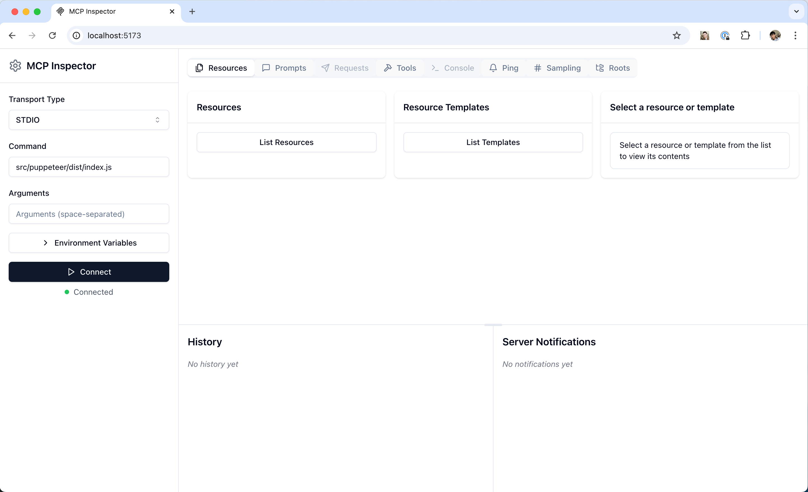

# What is MCP (Model Context Protocol)?

**MCP (Model Context Protocol)** is a server-side protocol and framework designed to connect AI models, LLM agents, or applications to external tools and content sources. It allows these agents to perform common workflow actions—such as searching databases, retrieving documentation, or converting files—by exposing a standard set of API endpoints.

## Key Features

- **Standardization**: MCP defines a uniform API that tools and data sources can implement, enabling interoperability between models and services[5].
- **Tool Orchestration**: Models can dynamically query tools (e.g., file converters, web search, knowledge bases) via the MCP server, which acts as a bridge between the AI and backend resources[2][3].
- **Document Conversion**: MCP servers often provide file conversion capabilities, such as turning PDFs, Office documents, images, or websites into Markdown for easy integration into context windows[1][6][7].
- **Agentic Workflows**: Facilitates automated workflows where LLMs or bots can reason, fetch data, and perform multi-step processes by calling MCP-exposed tools[2].
- **RESTful APIs**: Most MCP servers expose a REST API interface, allowing HTTP-based requests and responses for integration into diverse platforms[6].

## Typical Use Cases

- **AI Documentation Retrieval**: LLMs access technical documentation by converting it to Markdown via an MCP server[3][7].
- **Automated File Conversion**: Workflow automation for turning various file types (DOCX, PDF, audio, images) into Markdown for downstream AI consumption[1][6].
- **Enhanced Context for LLMs**: Dynamically pull relevant data packs or knowledge base snippets into


## MCP client
- Invoke tools
- Queries for Resources
- Interpoated Prompts

### MCP clients has 3 main componets:
  1. **Tools** [Model-control] (Functions invoked by the model eg- Retrieve/Search)
  2. **Resources** [Application-control] (Data exposed to the application eg- files, DB records, API Responses)
  3. **Prompts** [User-control] (Pre-defined templates for AI interations)

## MCP Server
- Exposes Tools
- Exposes Resources
- Exposes Prompts

## ✅ MCP Runtimes

The **Management Control Protocol (MCP)** supports two main runtime modes for the MCP server:

---

### 🔹 1. SSE (Server-Sent Events)

SSE allows the MCP server to run either **locally** or as a **remotely hosted** service. It uses **HTTP-based, one-way communication** where the server pushes events to the client.

#### 📌 Use SSE when:
- You need **local integrations**.̦
- Working with **command-line tools and scripts**.
- Performing **development and testing**.
- Operating in **single-client scenarios**.
- Handling **security-sensitive operations** (isolated from network risks).

---

### 🔹 2. STDIO (Standard Input/Output)

The **STDIO transport mechanism** enables the MCP server to communicate via **standard input and output streams**. It is primarily intended for **local hosting** scenarios.

#### 📌 Use STDIO when:
- Building **command-line tools**.
- Implementing **local-only integrations**.
- Requiring **simple inter-process communication**.
- Working with **shell scripts or automation tools**.

---

### 🎯 Summary

| Runtime Mode | Hosting Style        | Ideal Use Case                                     |
|--------------|----------------------|----------------------------------------------------|
| **SSE**      | Local / Remote       | Web-based tools, secure remote communication       |
| **STDIO**    | Local Only           | Scripts, local tools, development, testing         |


## MCP Inspector
The MCP Inspector is an interactive developer tool for testing and debugging MCP servers.


### Make your own doc reader and tool for MCP server (It's a prebuilt MCP server)
```https://github.com/langchain-ai/mcpdoc?tab=readme-ov-file```